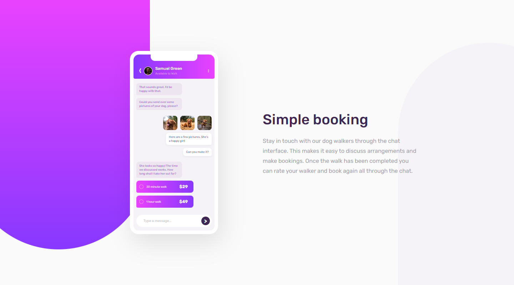

# Frontend Mentor - Chat app CSS illustration solution

This is a solution to the [Chat app CSS illustration challenge on Frontend Mentor](https://www.frontendmentor.io/challenges/chat-app-css-illustration-O5auMkFqY). Frontend Mentor challenges help you improve your coding skills by building realistic projects.

## Table of contents

- [Overview](#overview)
  - [Screenshot](#screenshot)
  - [Links](#links)
- [My process](#my-process)
  - [Built with](#built-with)
  - [What I learned](#what-i-learned)
  - [Useful resources](#useful-resources)
- [Author](#author)

**Note: Delete this note and update the table of contents based on what sections you keep.**

## Overview

### Screenshot



### Links

- Solution URL: [https://github.com/miranlegin/fem-chat-app](https://github.com/miranlegin/fem-chat-app)
- Live Site URL: [https://frontend-mentor-challenge04.netlify.app/](https://frontend-mentor-challenge04.netlify.app/)

## My process

### Built with

- HTML/CSS Only except 4 provided images
- Flexbox, Grid

### What I learned

I refined my knowledge on grid layouts, used html entities for icons, and have really enjoyed building this layout and used my creative thinking to solve some problems in the process.

HTML entities for icons

```html
<div class="header-arrow">&#10092;</div>
```

```html
<div class="header-dots">&hellip;</div>
```

Instead of using position absolute to stack things above each other

```css
.grid {
  display: grid;

  & > * {
    grid-column: 1 / -1;
    grid-row: 1 / -1;
  }
}
```

### Useful resources

- [Character entity lookup on Toptal](https://www.toptal.com/designers/htmlarrows/currency/) - Valuable source of all kinds of unicode/hexcode/html entity characters
- [10 don'ts with entity characters ](https://line25.com/articles/10-html-entity-crimes-you-really-shouldnt-commit/) - Interesting article about various entities for daily usage.
- [Using grid for stacking content](https://www.youtube.com/shorts/oy2iUDT0mf8) - Video about using grid for stacking things above each other

## Author

- Frontend Mentor - [@miranlegin](https://www.frontendmentor.io/profile/miranlegin)
